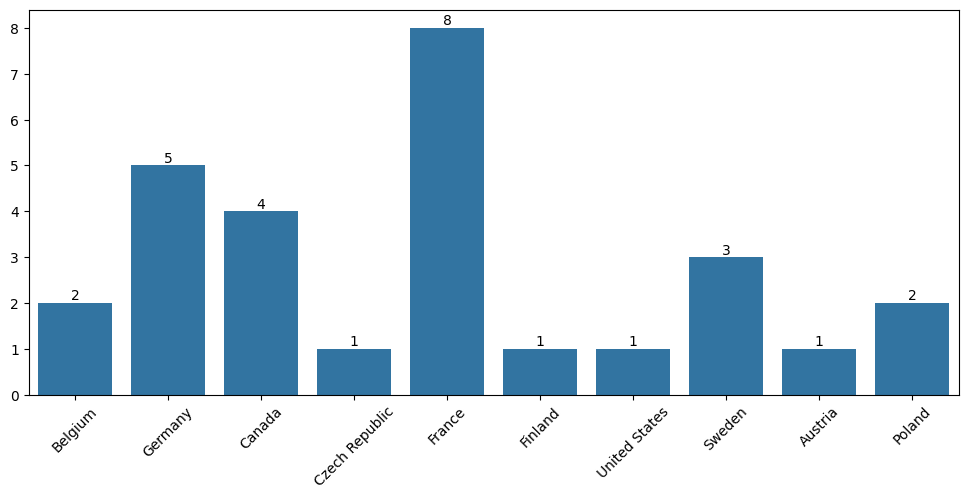
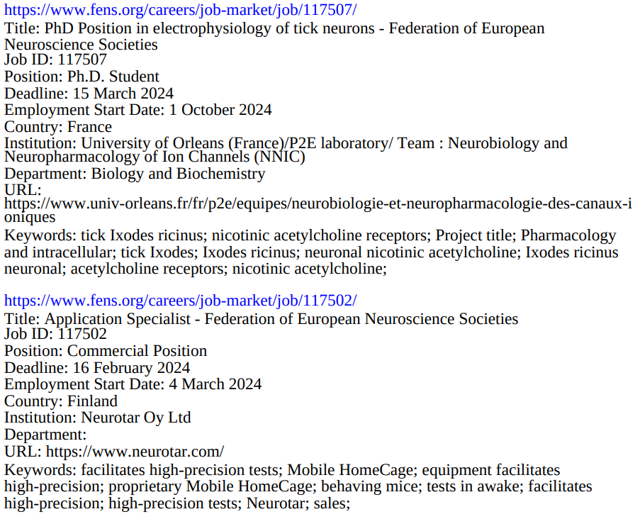

# FENS-Job Alert

[](https://twitter.com/intent/follow?screen_name=pradhitesh)
[](https://www.linkedin.com/in/pradhanhitesh/)
[](mailto:ihiteshpradhan@gmail.com)

<b> Last job alert created at: 2024-01-24 21:36:49 IST </b>

🔨 I am currently ..
```yaml
1. Developing job-posting visualization tool 
```

🌟 Introducing the Ultimate Career Companion: FENS PhD Jobs Market Scraper 🌟

Looking to kickstart your dream career in the field of neuroscience and beyond? Look no further! Our GitHub repository is your golden ticket to landing that perfect job. We've harnessed the power of web scraping and automation to bring you the FENS PhD Jobs Market like never before.

🚀 What does it do?
Our repository is a game-changer, effortlessly gathering up-to-the-minute job information. From job titles to locations, dates, job types, and detailed descriptions, we've got it all covered. Say goodbye to endless hours of manual searching and hello to automated job updates in your inbox.

🤖 GitHub Actions at Its Finest
We've supercharged this repository with GitHub Actions, making it a breeze to stay in the loop. It automatically scrapes and compiles the latest job listings every single week, and with surgical precision, it sends these juicy updates straight to your email.

📧 Sign Up, Sit Back, and Succeed
All you need to do is sign up to receive our weekly job updates through Google Groups. The rest is pure magic, as our repository takes care of the rest. Stay ahead of the job market with minimal effort. Reach out on ihiteshpradhan@gmail.com for more information.

<h1 align = "center">Country-wise Job Alerts</h1>
<p align="center">
    
</p>

<h1 align = "center">FENS Job-Alert Preview (PDF)</h1>
<p align="center">
    
</p>